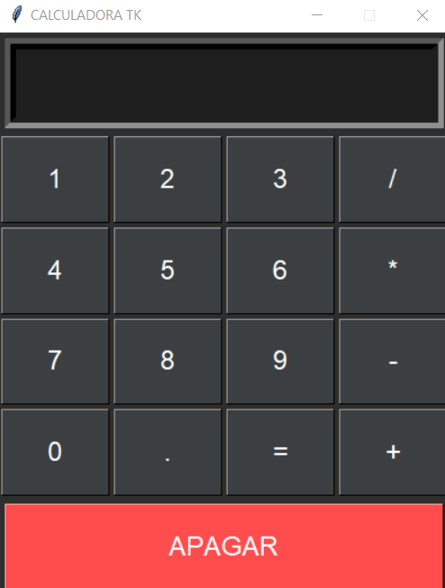

# CALCULADORA TK
🎈CALCULADORA BÁSICA COM INTERFACE GRÁFICA.

  

## DESCRIÇÃO:
A calculadora desenvolvida é uma aplicação gráfica simples implementada em Python usando a biblioteca Tkinter. Aqui está uma descrição de como ela funciona e quais são suas funcionalidades:

1. **Interface Gráfica:**
   - A interface é construída usando a biblioteca Tkinter, que é uma ferramenta padrão para criar GUIs (Interfaces Gráficas do Usuário) em Python.

2. **Layout da Calculadora:**
   - A calculadora tem uma entrada de texto na parte superior que exibe as entradas e resultados.
   - Os botões numéricos (0-9) estão dispostos em uma grade, juntamente com botões para operações aritméticas (+, -, *, /), ponto decimal, igual (=), e a tecla 'C' para apagar a entrada.

3. **Entrada e Exibição:**
   - O campo de entrada aceita a digitação de expressões matemáticas.
   - As entradas e os resultados são exibidos no formato da entrada padrão da linguagem Python. Por exemplo, a multiplicação é representada por '*', a divisão por '/', e assim por diante.

4. **Ações dos Botões:**
   - Os botões numéricos e operadores aritméticos inserem os respectivos caracteres na entrada.
   - O botão '=' realiza a avaliação da expressão na entrada e exibe o resultado.
   - O botão 'C' limpa a entrada, permitindo ao usuário recomeçar.

5. **Lógica de Execução:**
   - A lógica de execução está centralizada na função `on_button_click`, que é chamada quando um botão é pressionado.
   - Se o botão pressionado for '=', a expressão na entrada é avaliada e o resultado é exibido.
   - Caso contrário, o valor do botão é anexado à entrada existente.

6. **Manuseio de Erros:**
   - A aplicação tenta avaliar a expressão inserida, e caso haja um erro durante a avaliação (por exemplo, uma divisão por zero), o resultado exibido é "Erro".

## EXECUTANDO O PROJETO:
1. Execute o arquivo Python.
2. Isso abrirá a interface da calculadora.
3. Use os botões numéricos e operadores para realizar cálculos.
4. Para adicionar números ou operadores à expressão, clique nos botões correspondentes na interface da calculadora.
5. Para calcular o resultado da expressão, clique no botão '='.
6. O resultado será exibido no campo de entrada.
7. Para limpar a entrada, clique no botão 'C'.
8. Para sair da calculadora, feche a janela.

## SOBRE O EXECUTAVEL:
- Este arquivo executável está disponível apenas para `Windows X64`. Para executá-lo, basta dar dois cliques. O executável é bastante útil caso o Python não esteja instalado. Trata-se da mesma aplicação do arquivo `CODIGO.py`. Se desejar, você pode recompilá-lo novamente; é para isso que forneci o arquivo `imagem.ico`.

## NÃO SABE?
- Entendemos que para manipular arquivos em muitas linguagens e tecnologias, é necessário possuir conhecimento nessas áreas. Para auxiliar nesse aprendizado, oferecemos cursos gratuitos disponíveis:
* [CURSO DE PYTHON](https://github.com/VILHALVA/CURSO-DE-PYTHON)
* [CURSO DE TKINTER](https://github.com/VILHALVA/CURSO-DE-TKINTER)
* [CURSO DE EXE](https://github.com/VILHALVA/CURSO-DE-EXE)
* [CONFIRA MAIS CURSOS](https://github.com/VILHALVA?tab=repositories&q=+topic:CURSO)

## CREDITOS:
- [PROJETO CRIADO PELO VILHALVA](https://github.com/VILHALVA)

